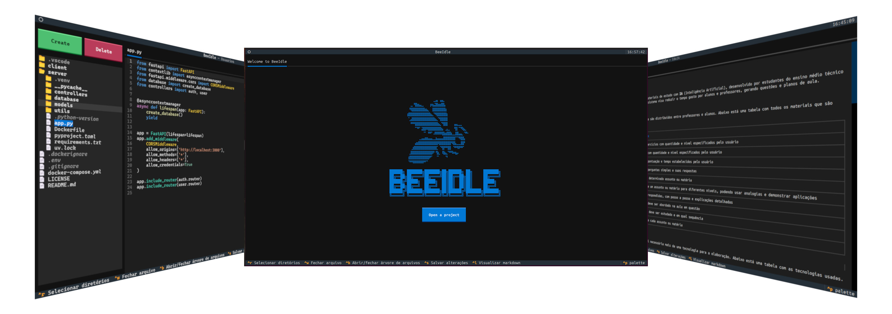

<p align="center">
    
    <h3 style="text-align: center">Editor de código feito pelo terminal</h3>
</p>

---

<p align="center">
    
</p>

## 🚀 Como executar

1. **Clone e acesse o repositório**

    ```bash
    git clone https://github.com/Davi-1903/BeeIdle.git
    cd BeeIdle
    ```

2. **Instale as dependências**

    ```bash
    uv sync
    # --------------- ou ---------------
    pip install -r requirements.txt
    ```

3. **Execute o editor**

    ```bash
    uv run main.py
    # --------------- ou ---------------
    python main.py
    ```

> [!TIP]
> Use ambiente virtual 😉
